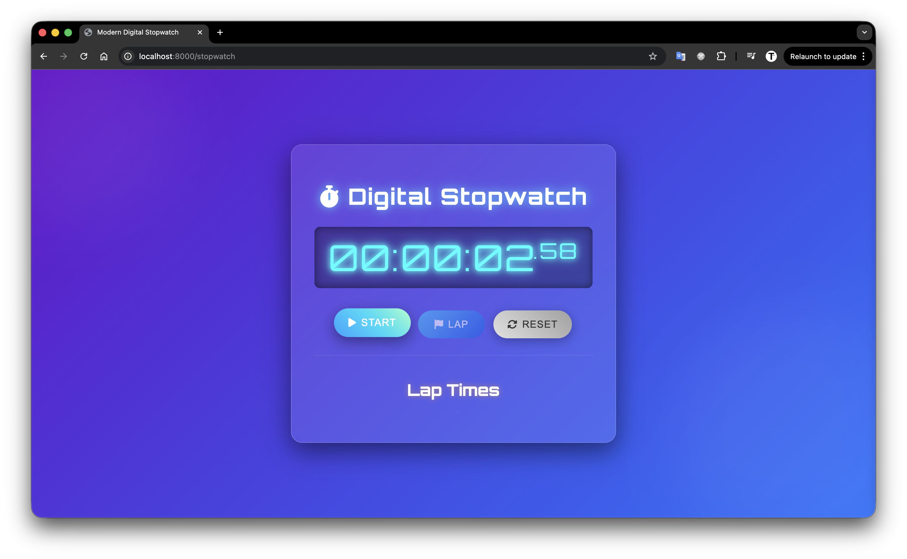
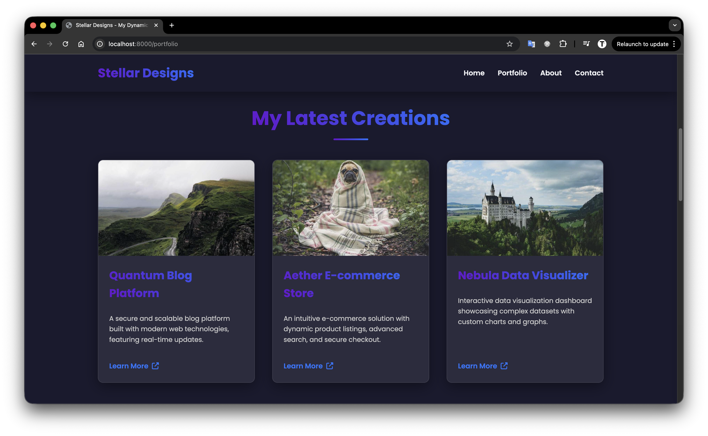
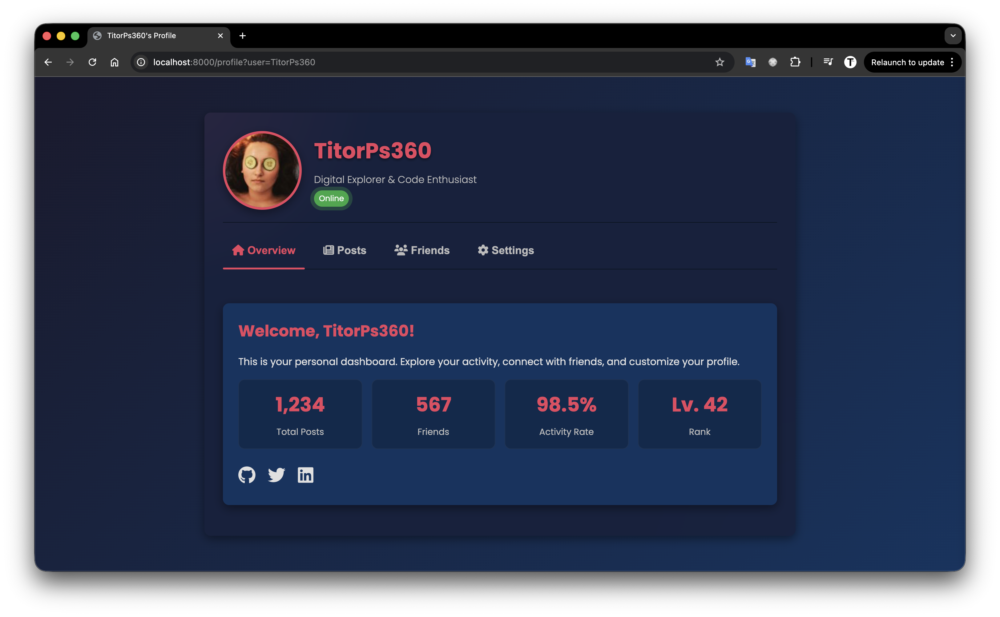
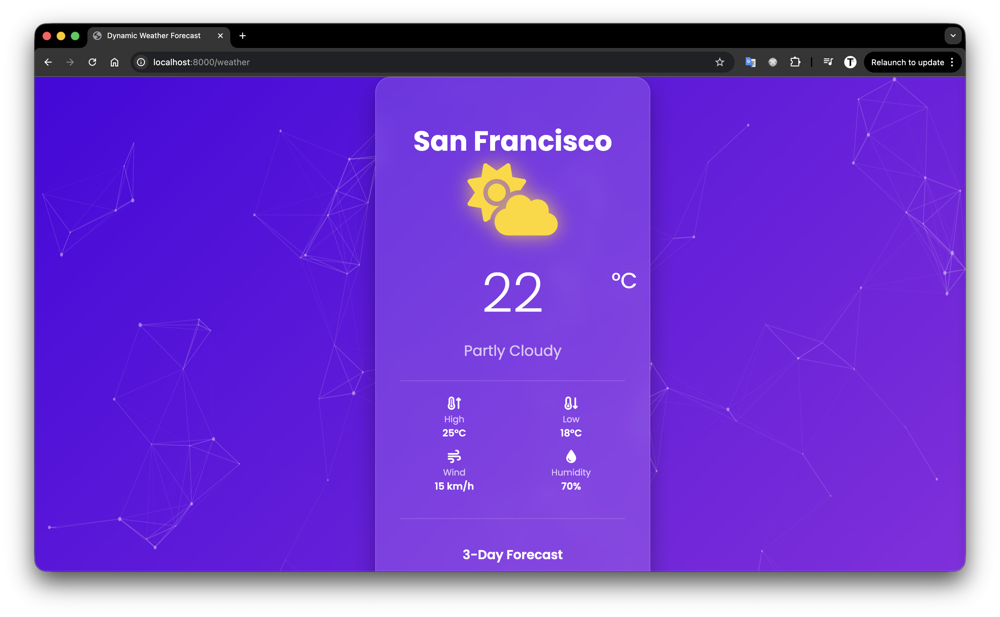
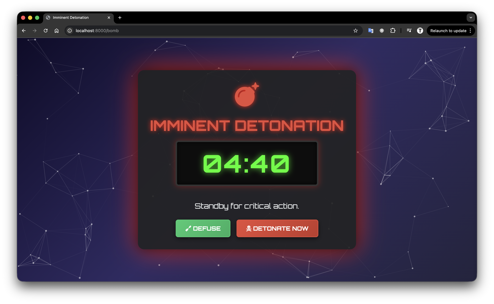
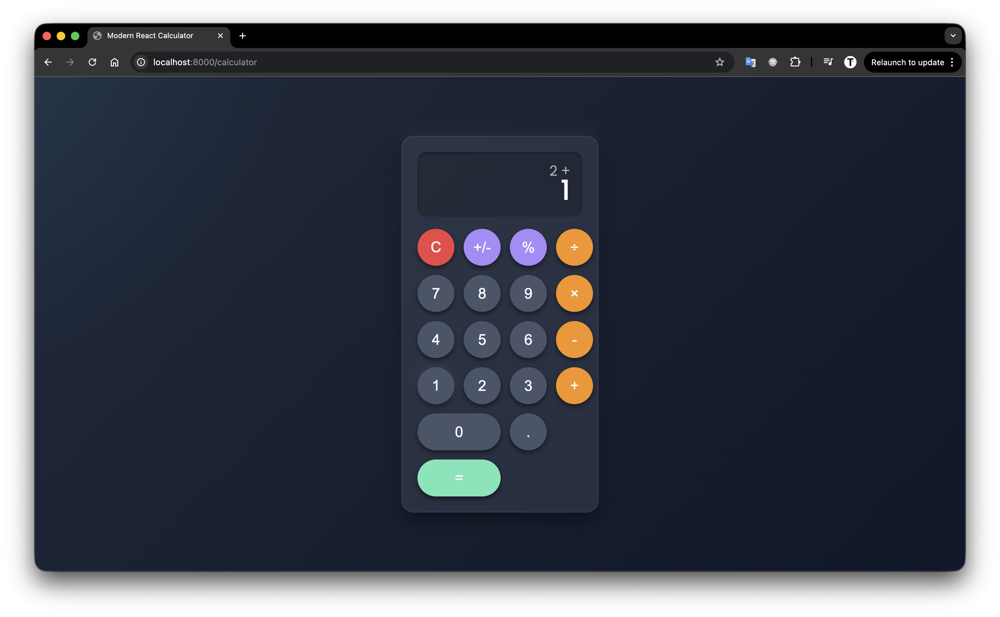
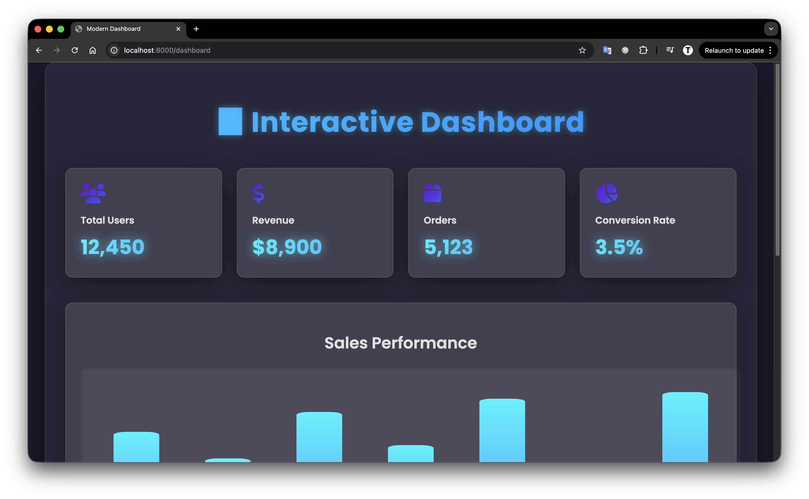
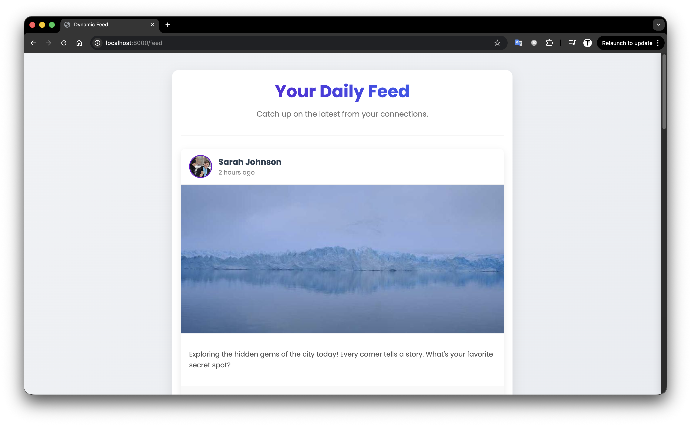

## About Chaotic Web

_Chaotic Web_ - a project for creating a web server that generates content using AI. The server can respond to various HTTP requests and generate appropriate HTML, JSON, JavaScript, or CSS content based on the request.

In this project, I built a FastAPI server that utilizes the Google Gemini AI model to generate content dynamically. The server can handle different types of requests and generate creative responses, making it a versatile tool for web development and experimentation.

## Youtube

For more information can be seen in my [video](https://youtu.be/0gGIB-80O-U) on YouTube.

[]("https://youtu.be/0gGIB-80O-U")

## Requirements

- uv
- Gemini API access

## Install

```
git clone https://github.com/TitorPs360/chaotic-web.git
cd chaotic-web
uv sync
```

## Usage

1. Setup Gemini API Key

   - Create a `.env` file in the root directory

   ```
   TOUCH .env
   ```

   - Add your Gemini API Key to the `.env` file

   ```
   GEMINI_API_KEY="your_gemini_api_key_here"
   ```

2. Run the server

   ```
   uv run uvicorn main:app --reload
   ```

3. Open your browser and go to `http://localhost:8000`

4. Enjoy your AI-generated content!

Example content generated by the server:

- Stopwatch - https://localhost:8000/stopwatch


- Portfolio - https://localhost:8000/portfolio


- Profile - https://localhost:8000/profile?user=TitorPs360


- Weather - https://localhost:8000/weather


- Bomb - https://localhost:8000/bomb


- Calculator - https://localhost:8000/calculator


- Dashboard - https://localhost:8000/dashboard


- Feed - https://localhost:8000/feed

